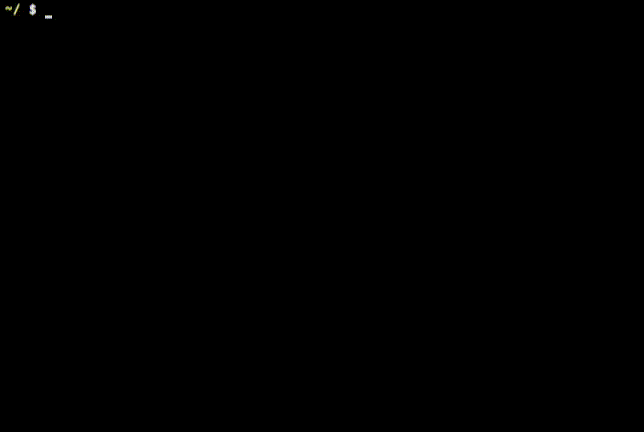

# syringe

[](https://github.com/tanksuzuki/syringe/releases)
[](LICENSE)

`syringe` is a lightweight template tool for infrastructure configuration.  
It aims to create easy-to-read configuration template in short time.

## Demo

`syringe` inserts the key/value to Go-Template file.  
The key/value can be specified from the command line option, **[TOML](https://github.com/toml-lang/toml)**, **JSON**, and **environment variables**.




## Usage

`syringe`  is a command-line application.

Usage is as follows,

```
$ syringe --help
Usage:
  syringe [options] <template> [<backend>...]

Application Options:
  -b, --backend=     Backend type (default: toml) [$SY_BACKEND]
      --debug        Enable debug logging [$SY_DEBUG]
      --delim-left=  Template start delimiter (default: {{) [$SY_DELIML]
      --delim-right= Template end delimiter (default: }}) [$SY_DELIMR]
  -h, --help         Show this help
  -v, --variable=    Set key/values (format key:value)
      --version      Show version information
```

Insert the value to the template file specified by `<template>`.

The value can be defined by `-v, --variable` flag and `<backend>` file.  
`-v, --variable` flag and `<backend>` file can be specified multiple times.

```
+-------------------------+      +-----------+         +------------+
| 1. Stdin from pipe      |----->|           |         |            |
+-------------------------+      |           |         |            |
                                 |           |         |            |
+-------------------------+      |           | Insert  |   Golang   | Merged string  +----------+
| 2. <backend> or Env var |----->| Key/Value |-------->|  Template  |--------------->|  Stdout  |
+-------------------------+      |   Table   |         | <template> |                +----------+
                                 |           |         |            |
+-------------------------+      |           |         |            |
| 3. -v, --variable flag  |----->|           |         |            |
+-------------------------+      +-----------+         +------------+
```

`<backend>` type can be specified by `-b, --backend` flag.  
You can specify the type of following.

* env
* json
* toml (default)

Go-Template delimiter is `{{` and `}}` by default.  
If you want to change the delimiter, please specify `--delim-left` and `--delim-right` flag.

## Template functions

The function of the following, you can call in the template.
sprig functions included.
see [sprig document](http://masterminds.github.io/sprig/).

### `exec`

Run the external command and insert the results to the template.

```
This configuration was generated at {{exec "date +%Y-%m-%d"}}
```

Output:

```
This configuration was generated at 2016-05-02
```

### `toNetwork`

Convert the IP address to Network address.  
You can specify either the prefix length and subnet mask.

```
{{toNetwork "192.168.1.1" "255.255.255.0"}}
```

Output:

```
192.168.1.0
```

### `toPrefixLen`

Convert the Subnet mask to Prefix length.

```
{{toPrefixLen "255.255.255.0"}}
```

Output:

```
24
```

### `toSubnetMask`

Convert the Prefix length to Subnet mask.

```
{{toSubnetMask "24"}}
```

Output:

```
255.255.255.0
```

## Install

Installing `syringe` is way too easy.
It have no external dependencies.

Please download from [RELEASE PAGE](https://github.com/tanksuzuki/syringe/releases).

## Contribution

1. Fork ([https://github.com/tanksuzuki/syringe/fork](https://github.com/tanksuzuki/syringe/fork))
2. Create a feature branch
3. Commit your changes and run `go fmt ./...`
4. Rebase your local changes against the master branch
5. Run test suite with the `go test ./...` command and confirm that it passes
6. Create new Pull Request

## License

syringe is licensed under the Apache License, Version 2.0.  
See [LICENSE](LICENSE) for the full license text.

## Author

[Asuka Suzuki](https://github.com/tanksuzuki)
